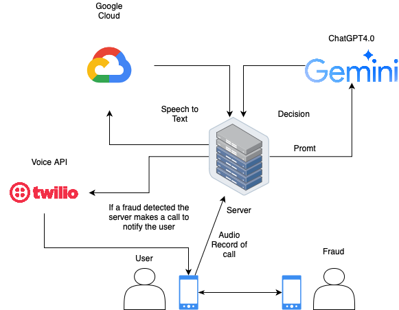
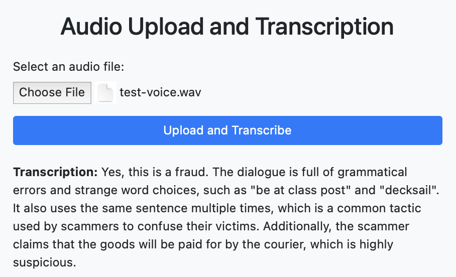

# cyber-guard-ai-shield
cyber-guard-ai-shield

We are a team from Almaty, Kazakhstan, and our CyberGuard AI Shield project is a unique combination of expertise from Satpayev University and Al-Farabi Kazakh National University.

Our cybersecurity innovations support two important Sustainable Development Goals. Goal #9, Industry, Innovation and Infrastructure, is embodied in our advanced methods to combat audio phishing. In parallel, we are working towards Goal #16 - peaceful societies, justice and strong institutions, creating a secure digital space.

Join us on this exciting journey, where Kazakhstan's innovativeness and cutting-edge technologies come together to ensure sustainability in the digital world.

More information about it here in the links below:
https://youtu.be/ttDXaXkywxg
https://youtu.be/14w1hx7nkpI

The app uses 3.12.1 python version. Was built using flask and uses google solutions as Google Cloud - Speech to text recognition and Google Gemini AI

The user can upload .wav format audio using web page and the app gives answer either it is fraud dialog or not and some recommendation or explanation.

If the app detected the fraud it can make a phone call to a user to warn and prevent from audio frauding (under development).

The architecture



Main page with output




Building instruction:
```
git clone repo-url
```
```
cd cyber-guard-ai-shield/
```
```
python -m venv .venv
```
```
source .venv/bin/activate
```
```
pip install -r requirements.txt
```
```
python app.py
```
The app uses port 5001
After checking the app type this in terminal
```
deactivate
```
